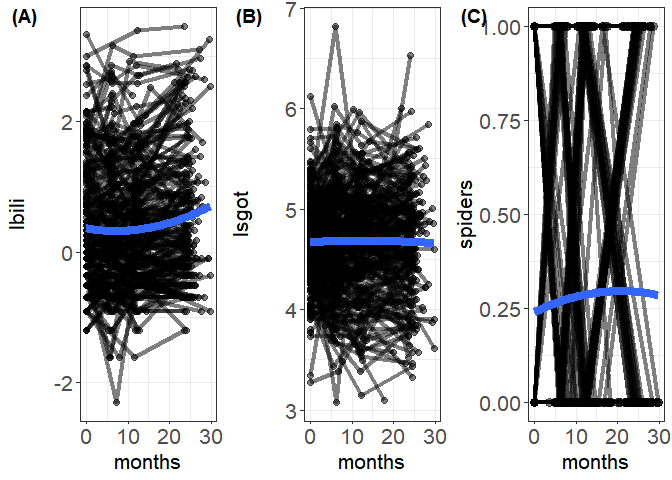
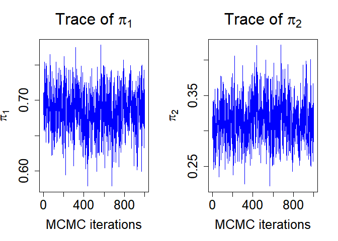

-   [Bayesian-Consensus-Clustering](#bayesian-consensus-clustering)
    -   [Setup](#setup)
    -   [Result from summary folder](#result-from-summary-folder)
    -   [Results from graphic output
        folder](#results-from-graphic-output-folder)
        -   [Trajectories for each
            marker](#trajectories-for-each-marker)
        -   [Summary statistics for all
            parameters](#summary-statistics-for-all-parameters)
        -   [Trace plot for PPI to inspect
            convergence](#trace-plot-for-ppi-to-inspect-convergence)

# Bayesian-Consensus-Clustering

## Setup

There are two main folders The summary folder contains code that gives
model summary only. The graphic output folder visualizes the results. To
run the code, first navigate to either `summary` or `graphich output`
folder and set current folder as working directory.

## Result from summary folder

Results from exmaple

``` r
> fit.BCC$summary.stat$PPI
                  [,1]        [,2]
mean        0.79474912  0.20525088
sd          0.04368524  0.04368524
2.5%        0.70057013  0.13256579
97.5%       0.86743421  0.29942987
geweke.stat 0.92788809 -0.92788809

> fit.BCC$summary.stat$ALPHA
                   [,1]       [,2]        [,3]
mean         0.80260557 0.50588271  0.87723123
sd           0.04409383 0.00546498  0.05000172
2.5%         0.73086562 0.50011619  0.78506714
97.5%        0.87966656 0.51894468  0.98112848
geweke.stat -0.44096846 0.28068139 -0.24425527

> fit.BCC$summary.stat$GA
[[1]]
, , 1

                   [,1]      [,2]
mean        -0.40601148 1.5927662
sd           0.06745642 0.1047098
2.5%        -0.53719087 1.4105057
97.5%       -0.26418628 1.8241435
geweke.stat -1.77950969 1.5074619

, , 2

                    [,1]        [,2]
mean         0.004370976 0.014538832
sd           0.002038668 0.003148562
2.5%         0.000826820 0.008778884
97.5%        0.008498853 0.020473345
geweke.stat -3.021475187 0.775005515


[[2]]
, , 1

                  [,1]        [,2]
mean        4.70529869  5.59804230
sd          0.05915515  0.03607394
2.5%        4.58360223  5.53053336
97.5%       4.80947449  5.66298393
geweke.stat 0.22801624 -0.75583503

, , 2

                    [,1]         [,2]
mean        -0.011684530 -0.002390531
sd           0.001637444  0.001201627
2.5%        -0.014946694 -0.004739064
97.5%       -0.008976688 -0.000243194
geweke.stat  0.470934639 -0.932315679


[[3]]
, , 1

                  [,1]      [,2]
mean        -1.5606782 1.7970701
sd           0.4618175 0.6398377
2.5%        -2.4133218 0.7165736
97.5%       -0.5889110 3.3114258
geweke.stat  0.8325084 1.1956285

, , 2

                   [,1]        [,2]
mean        0.030584706  0.01236938
sd          0.015885539  0.01737053
2.5%        0.005538517 -0.02911865
97.5%       0.070120505  0.04451236
geweke.stat 0.274449168  0.67597695


> fit.BCC$summary.stat$SIGMA.SQ.U
[[1]]
, , 1

                     [,1]
mean         3.727492e-05
sd           8.293761e-06
2.5%         2.584153e-05
97.5%        5.369400e-05
geweke.stat -2.112115e-01

, , 2

                    [,1]
mean        5.217424e-05
sd          9.666406e-06
2.5%        3.673481e-05
97.5%       7.113944e-05
geweke.stat 6.282917e-01


[[2]]
, , 1

                     [,1]
mean         3.409460e-05
sd           6.500162e-06
2.5%         2.403157e-05
97.5%        4.874368e-05
geweke.stat -2.053133e+00

, , 2

                     [,1]
mean         2.319546e-05
sd           3.611774e-06
2.5%         1.643193e-05
97.5%        3.121602e-05
geweke.stat -1.554764e-01


[[3]]
, , 1

                    [,1]
mean        4.102649e-05
sd          8.384566e-06
2.5%        2.842640e-05
97.5%       5.941488e-05
geweke.stat 4.752748e-01

, , 2

                    [,1]
mean        6.359277e-05
sd          1.745721e-05
2.5%        3.921035e-05
97.5%       1.040450e-04
geweke.stat 1.242202e+00


> fit.BCC$summary.stat$SIGMA.SQ.E
[[1]]
                  [,1]       [,2]
mean        0.37393750 0.37393750
sd          0.01775766 0.01775766
2.5%        0.34146760 0.34146760
97.5%       0.40594660 0.40594660
geweke.stat 1.96269393 1.96269393

[[2]]
                   [,1]        [,2]
mean        0.084539874 0.084539874
sd          0.003916127 0.003916127
2.5%        0.078067818 0.078067818
97.5%       0.093544052 0.093544052
geweke.stat 0.581838511 0.581838511

[[3]]
NULL

> fit.BCC$alpha.adjust
[1] 0.4571463
```

## Results from graphic output folder

### Trajectories for each marker



### Summary statistics for all parameters

``` r
library(knitr)
fit.BCC <- readRDS(file = "graphic output/BCC.rds")
knitr::kable(fit.BCC$summary.stat$PPI, caption = "PPI")
```

|             |           |            |
|:------------|----------:|-----------:|
| mean        | 0.6846829 |  0.3153171 |
| sd          | 0.0312885 |  0.0312885 |
| 2.5%        | 0.6213346 |  0.2557946 |
| 97.5%       | 0.7442054 |  0.3786654 |
| geweke.stat | 2.0619303 | -2.0619303 |

PPI

``` r
knitr::kable(fit.BCC$summary.stat$ALPHA, caption = "ALPHA")
```

|             |           |            |            |
|:------------|----------:|-----------:|-----------:|
| mean        | 0.9843985 |  0.7926552 |  0.5051915 |
| sd          | 0.0154863 |  0.0330557 |  0.0051644 |
| 2.5%        | 0.9456004 |  0.7289532 |  0.5001074 |
| 97.5%       | 0.9994359 |  0.8572505 |  0.5189403 |
| geweke.stat | 0.0566837 | -0.9288953 | -1.0725456 |

ALPHA

``` r
knitr::kable(fit.BCC$summary.stat$GA, caption = "GA")
```

<table class="kable_wrapper">
<caption>
GA
</caption>
<tbody>
<tr>
<td>

|             |        1.1 |       2.1 |       1.2 |       2.2 |
|:------------|-----------:|----------:|----------:|----------:|
| mean        |  0.0053145 | 1.9855685 | 0.0043461 | 0.0153585 |
| sd          |  0.0623581 | 0.0963243 | 0.0019015 | 0.0028221 |
| 2.5%        | -0.1151518 | 1.7970712 | 0.0006874 | 0.0096871 |
| 97.5%       |  0.1265889 | 2.1706687 | 0.0081502 | 0.0207714 |
| geweke.stat |  2.2914650 | 2.3898558 | 1.8107792 | 1.6448332 |

</td>
<td>

|             |       1.1 |       2.1 |        1.2 |       2.2 |
|:------------|----------:|----------:|-----------:|----------:|
| mean        | 4.2124112 | 5.1609872 | -0.0040831 | 0.0037010 |
| sd          | 0.0515753 | 0.0505456 |  0.0015276 | 0.0015514 |
| 2.5%        | 4.1043421 | 5.0678189 | -0.0071930 | 0.0005976 |
| 97.5%       | 4.3095584 | 5.2648015 | -0.0011940 | 0.0066904 |
| geweke.stat | 2.4448900 | 0.3381954 |  2.5896830 | 0.3045210 |

</td>
<td>

|             |        1.1 |        2.1 |        1.2 |        2.2 |
|:------------|-----------:|-----------:|-----------:|-----------:|
| mean        |  1.0271694 | -1.6638980 |  0.0165802 |  0.1969798 |
| sd          |  0.4060496 |  1.6309635 |  0.0114546 |  0.7338681 |
| 2.5%        |  0.2920963 | -4.2689140 | -0.0059527 | -0.0210020 |
| 97.5%       |  1.8619125 |  2.9310257 |  0.0399977 |  2.2570126 |
| geweke.stat | -0.9270167 |  0.3047405 | -0.1764254 |  0.0603819 |

</td>
</tr>
</tbody>
</table>

``` r
knitr::kable(fit.BCC$summary.stat$SIGMA.SQ.U, caption = "SIGMA.SQ.U")
```

<table class="kable_wrapper">
<caption>
SIGMA.SQ.U
</caption>
<tbody>
<tr>
<td>

|             |       1.1 |       1.2 |
|:------------|----------:|----------:|
| mean        | 0.0000366 | 0.0000517 |
| sd          | 0.0000067 | 0.0000111 |
| 2.5%        | 0.0000256 | 0.0000344 |
| 97.5%       | 0.0000516 | 0.0000762 |
| geweke.stat | 2.1322256 | 1.9117365 |

</td>
<td>

|             |       1.1 |        1.2 |
|:------------|----------:|-----------:|
| mean        | 0.0000310 |  0.0000337 |
| sd          | 0.0000050 |  0.0000059 |
| 2.5%        | 0.0000229 |  0.0000239 |
| 97.5%       | 0.0000419 |  0.0000459 |
| geweke.stat | 0.1373323 | -1.1950659 |

</td>
<td>

|             |       1.1 |       1.2 |
|:------------|----------:|----------:|
| mean        | 0.0000332 | 0.0000266 |
| sd          | 0.0000055 | 0.0000042 |
| 2.5%        | 0.0000238 | 0.0000196 |
| 97.5%       | 0.0000461 | 0.0000364 |
| geweke.stat | 0.8116125 | 0.6841844 |

</td>
</tr>
</tbody>
</table>

``` r
knitr::kable(fit.BCC$summary.stat$SIGMA.SQ.E, caption = "SIGMA.SQ.E")
```

<table class="kable_wrapper">
<caption>
SIGMA.SQ.E
</caption>
<tbody>
<tr>
<td>

|             |            |            |
|:------------|-----------:|-----------:|
| mean        |  0.3483501 |  0.3483501 |
| sd          |  0.0166566 |  0.0166566 |
| 2.5%        |  0.3162897 |  0.3162897 |
| 97.5%       |  0.3832480 |  0.3832480 |
| geweke.stat | -0.6803123 | -0.6803123 |

</td>
<td>

|             |           |           |
|:------------|----------:|----------:|
| mean        | 0.1433281 | 0.1433281 |
| sd          | 0.0072367 | 0.0072367 |
| 2.5%        | 0.1294198 | 0.1294198 |
| 97.5%       | 0.1580316 | 0.1580316 |
| geweke.stat | 0.0375309 | 0.0375309 |

</td>
<td>

\|\| \|\| \|\| \|\|

</td>
</tr>
</tbody>
</table>

### Trace plot for PPI to inspect convergence


